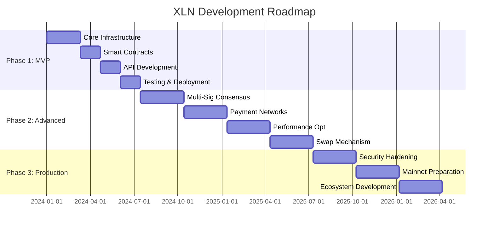

# XLN (Extended Lightning Network) - Complete Technical Specification

## Table of Contents

1. [Executive Summary](#1-executive-summary)
2. [System Overview](#2-system-overview)
3. [Architecture Design](#3-architecture-design)
4. [Core Components](#4-core-components)
5. [Reserve-Credit System](#5-reserve-credit-system)
6. [Entity System](#6-entity-system)
7. [Merkle Tree Implementation](#7-merkle-tree-implementation)
8. [Payment Channels](#8-payment-channels)
9. [State Management](#9-state-management)
10. [Transaction System](#10-transaction-system)
11. [Consensus Mechanism](#11-consensus-mechanism)
12. [Storage Architecture](#12-storage-architecture)
13. [Network Communication](#13-network-communication)
14. [Security Model](#14-security-model)
15. [Performance Optimizations](#15-performance-optimizations)
16. [API Specifications](#16-api-specifications)
17. [Development Roadmap](#17-development-roadmap)
18. [Implementation Guidelines](#18-implementation-guidelines)
19. [Testing Strategy](#19-testing-strategy)
20. [Deployment Considerations](#20-deployment-considerations)

---

## 1. Executive Summary

XLN (Extended Lightning Network) is an innovative hierarchical blockchain architecture built on Ethereum that revolutionizes payment channel networks by solving the fundamental "inbound capacity problem" present in existing systems like Lightning Network and Raiden.

### 1.1 Key Innovations

- **Reserve-Credit System**: Combines collateral-based security with credit-based flexibility
- **Hierarchical Actor Model**: Five-layer machine architecture (Server → Signer → Entity → Channel/Depositary)
- **Configurable Merkle Trees**: Optimized state management with configurable parameters
- **Multi-Party Swaps**: Intent-matching with atomic execution via HTLCs
- **Programmable Entities**: Account abstraction with governance capabilities

### 1.2 Performance Targets

- **Scalability**: 10M+ payment channels per hub
- **Speed**: 100ms block times for real-time processing
- **Efficiency**: 10M channels manageable in 100GB RAM
- **Throughput**: Minimal on-chain transactions through off-chain processing

### 1.3 Design Goals

- Address inbound capacity limitations in payment channel networks
- Enable complex multi-party business logic and governance
- Maintain full auditability and security
- Support efficient capital utilization through credit mechanisms
- Provide flexible, programmable account abstractions

---

## 2. System Overview

### 2.1 Conceptual Model

XLN implements a hierarchical structure of autonomous "machines" (actors) that maintain their own state and communicate through standardized message interfaces. This design is inspired by the Actor Model and provides clear separation of concerns while enabling complex interactions.

```
Server (Root Machine)
├── Signer Machines (Personal identity/wallet)
│   ├── Entity Machines (Organizational units)
│   │   ├── Channel Machines (Payment channels)
│   │   └── Depositary Machines (Asset bridges)
│   └── More Entities...
└── More Signers...
```

### 2.2 Architecture Layers

The system employs a three-layer architecture:

1. **Base Layer**: Depositary contract for core payment channel mechanics
2. **Programmability Layer**: SubcontractProvider for custom payment conditions (HTLCs, swaps)
3. **Governance Layer**: EntityProvider for programmable control via multi-signature boards

### 2.3 Machine Types

#### Server Machine
- Root-level orchestrator and message router
- Maintains global state tree
- Aggregates messages every 100ms into blocks
- No consensus required (single instance per hub)

#### Signer Machine
- Represents individual identity and holds private keys
- Creates and signs transactions
- Manages entity states and participates in consensus
- Parent to Entity machines

#### Entity Machine
- Organizational/business logic container
- Can be single or multi-signature
- Manages proposals, voting, and governance
- Represents wallets, DAOs, hubs, or applications
- Parent to Channels and Depositaries

#### Channel Machine
- Bilateral payment channel implementation
- Enables instant off-chain transfers
- Maintains dispute proofs and state synchronization
- Leaf node (no submachines)

#### Depositary Machine
- Bridge to external blockchains and smart contracts
- Manages asset deposits, withdrawals, and reserves
- Interfaces with Ethereum contracts
- Leaf node (no submachines)

---

## 3. Architecture Design

### 3.1 Actor Model Implementation

Each machine follows strict actor principles:

- **Encapsulated State**: Private internal state with controlled access
- **Message-Based Communication**: Asynchronous message passing between machines
- **Location Transparency**: Machines addressable by hierarchical IDs
- **Supervision Hierarchy**: Parent machines supervise and manage children
- **Fault Isolation**: Machine failures don't cascade to other machines

### 3.2 Message Flow Patterns

```
External Request → Server → Signer → Entity → Channel/Depositary
                                         ↓
                                    State Change
                                         ↓
Event ← Server ← Signer ← Entity ← Response
```

### 3.3 Hierarchical Addressing

Machine addresses use 32-byte hierarchical identifiers:
- Bytes 0-7: Server ID (usually 0 for single-server deployments)
- Bytes 8-15: Signer ID  
- Bytes 16-23: Entity ID
- Bytes 24-31: Channel/Depositary ID

This addressing scheme enables efficient routing and clear ownership hierarchies.

---

## 4. Core Components

### 4.1 Block Structure

```javascript
Block = {
  previous_block: Hash,           // Link to previous block
  block_number: Integer,          // Sequential block number
  timestamp: Integer,             // Block creation timestamp
  transactions: RLP_encoded_mempool, // Serialized transaction data
  state_hash: Hash,              // Merkle root of current state
  signatures: AggregatedSignature // Optional multi-sig validation
}
```

### 4.2 Transaction Types

#### Input Transactions (TX In)
- Originate from external users/systems
- Signed by initiating party
- Structure: `{from, to, nonce, data, signature}`

#### Output Transactions (TX Out)  
- Sent to external systems/channels
- Multi-signed by validators when required
- Contains aggregated signatures for security

#### Event Messages
- Internal machine communication
- No signatures required (trusted environment)
- Guaranteed delivery within same node

### 4.3 State Components

#### Machine State
```javascript
MachineState = {
  id: Buffer(32),                    // Unique machine identifier
  type: Enum(server|signer|entity|channel|depositary),
  root: BlockHash,                   // Current block hash
  state: MerkleRoot,                 // State merkle root
  submachines: Map<ID, MachineReference> // Child machines
}
```

#### Entity State
```javascript
EntityState = {
  status: Enum(idle|processing|waiting),
  validators: Map<Address, ValidatorInfo>,
  proposals: Map<Hash, Proposal>,
  balances: Map<Asset, Amount>,
  channels: Map<ID, ChannelRoot>,
  orderbook: Map<AssetPair, OrderTree>,
  nonce: Integer,
  finalBlock: EntityBlock,
  consensusBlock: EntityBlock
}
```

---

## 5. Reserve-Credit System

The reserve-credit system is XLN's cornerstone innovation, addressing the inbound capacity problem that limits traditional payment channel networks.

### 5.1 Core Concepts

#### Reserves
- Tokens committed to the Depositary contract
- Provide security and operational flexibility
- Can be converted to channel collateral or used for debt settlement
- Not locked to specific channels

#### Collateral
- Tokens locked within specific channels
- Provides immediate transaction liquidity
- Protects against malicious behavior
- Forms the basis for secure payments

#### Credit Limits
- Extend transaction capacity beyond collateral
- Set independently by each channel participant
- Enable trust-based relationships
- Similar to traditional credit lines

### 5.2 Channel State Tracking

Channel state is tracked via four key components:

- **ondelta**: Permanent state changes (deposits, settlements)
- **offdelta**: Temporary state changes (pending payments)
- **collateral**: Total tokens locked in the channel
- **leftCreditLimit & rightCreditLimit**: Credit extended by each party

### 5.3 Transaction Flow

#### Setup Phase
1. Users deposit tokens into reserves
2. Allocate collateral to channels  
3. Set mutual credit limits
4. Channel becomes operational

#### Payment Phase
1. Utilize available collateral first
2. Consume credit when collateral is exhausted
3. Total capacity = collateral + ownCreditLimit + peerCreditLimit
4. Update channel state with new balances

#### Settlement Phase
1. Cooperative closure preferred
2. Dispute resolution if needed
3. Collateral distributed according to final state
4. Unpaid credit becomes debt settled from reserves

### 5.4 Advantages

- **Capital Efficiency**: Less locked capital, higher transaction volumes
- **Security**: Collateral-backed payments with dispute resolution
- **Scalability**: Off-chain processing with batched settlement
- **Flexibility**: Credit enables trust relationships without full collateralization

---

## 6. Entity System

Entities are programmable state machines that manage accounts, governance, and complex business logic.

### 6.1 Entity Types

Entities can represent various organizational structures:

- **Personal Wallets**: Single-signer entities for individuals
- **Organizational Wallets**: Multi-sig entities for companies/DAOs
- **Payment Hubs**: High-connectivity routing nodes
- **Exchanges**: Automated market makers and order books
- **Applications**: Custom business logic implementations

### 6.2 State Management

#### Merkle Storage Structure
Entities maintain state in optimized Merkle trees with:
- Multi-layer organization (signer/entity/storage layers)
- Configurable nibble sizes (4-bit for entities, 8-bit for storage)
- Support for massive scale (10k+ signers, 10k+ entities per signer, 1M+ channels per entity)

#### Storage Types
- **Type 0x01**: Proposals and voting records
- **Type 0x02**: Order books and swap data  
- **Type 0x03**: Channel states and references
- **Type 0x04**: Validator sets and permissions

### 6.3 Governance System

#### Board-Based Validation
- Entities governed by configurable validator boards
- Voting thresholds customizable per entity
- Supports nested entities (DAOs containing DAOs)
- Recursive signature verification with cycle detection

#### Proposal System
```javascript
Proposal = {
  id: Hash,                          // Unique proposal identifier
  type: Enum(transfer|addValidator|removeValidator|custom),
  data: Buffer,                      // Proposal-specific data
  proposer: Address,                 // Proposal creator
  votes: Map<Address, Signature>,    // Collected votes
  created_at: Timestamp,             // Creation time
  expires_at: Timestamp,             // Expiration time
  status: Enum(pending|approved|rejected|expired)
}
```

#### Execution Rules
- Proposals execute when votes ≥ quorum threshold
- Time-based expiration prevents stale proposals
- Atomic execution ensures consistency

---

## 7. Merkle Tree Implementation

XLN uses highly optimized, configurable Merkle trees for efficient state management at scale.

### 7.1 Configuration Parameters

```typescript
interface TreeConfig {
  bitWidth: number;      // 1-16 bits per chunk (default: 4)
  leafThreshold: number; // 1-1024 entries before splitting (default: 16)
}
```

### 7.2 Tree Structure

#### Node Types
- **Branch Nodes**: Internal nodes with dynamic children
- **Leaf Nodes**: Terminal nodes with value maps
- **Automatic Splitting**: Based on configurable threshold

#### Path Processing
- Configurable bit width for path chunks
- Nibble-based addressing with padding flags
- Efficient traversal and updates

### 7.3 Layer Organization

#### Signer Layer (4-bit nibbles)
- Manages signer-level state
- Optimized for moderate branching

#### Entity Layer (4-bit nibbles)  
- Handles entity state within signers
- Supports thousands of entities per signer

#### Storage Layer (8-bit nibbles)
- Manages detailed entity storage
- Higher branching factor for efficiency

### 7.4 Performance Characteristics

#### Targets
- Support 10k+ signers efficiently
- Handle 10k+ entities per signer
- Manage 1M+ channels per entity
- Sub-50ms path lookups
- <1ms node splits

#### Optimizations
- Hash caching reduces redundant calculations
- Lazy evaluation minimizes computational overhead
- Batch updates for atomic changes
- Memory overlays for pending state

### 7.5 Visualization Support

```
Root (Server)
├── Signer_001 [Branch] (5 entities)
│   ├── Entity_001 [Leaf] (12 channels) hash:a7b3...
│   ├── Entity_002 [Branch] (45 values)
│   │   ├── Storage_01 [Leaf] (8 proposals)
│   │   └── Storage_03 [Leaf] (15 channels)
│   └── ...
└── Signer_002 [Branch] (3 entities)
    └── ...
```

---

## 8. Payment Channels

### 8.1 Channel Architecture

#### Submachine Design
- Channels operate as submachines within entities
- Local-first operations for instant updates
- Global verification ensures consistency
- Replicated state across participating entities

#### State Synchronization
- Deterministic state machines ensure consistency
- Cryptographic commitments prevent disputes
- Periodic checkpoints for recovery

### 8.2 Channel Lifecycle

#### Creation
1. Entities agree on channel parameters
2. Initial deposits allocated from reserves
3. Channel ID generated and registered
4. State machines initialized

#### Operation
1. Off-chain balance updates
2. Signed state transitions
3. Instant payment execution
4. Dispute proof maintenance

#### Settlement
1. Cooperative close preferred
2. Dispute mechanism for conflicts
3. On-chain settlement as fallback
4. Final state recorded in Depositary

### 8.3 Channel State

```javascript
ChannelState = {
  id: ChannelID,                    // Unique channel identifier
  participants: [AddressA, AddressB], // Channel parties
  balances: Map<Asset, {A: Amount, B: Amount}>, // Current balances
  nonce: Integer,                   // State sequence number
  status: Enum(ready|pending|closing|closed),
  latest_block: BlockHash,          // Latest committed state
  dispute_window: Duration,         // Challenge period
  collateral: Amount,               // Locked tokens
  creditLimits: {left: Amount, right: Amount} // Credit extensions
}
```

### 8.4 Payment Routing

Multi-hop payments using Hash Time-Locked Contracts (HTLCs):

```
A → B → C → D
  ↓   ↓   ↓
 ch1 ch2 ch3

1. D generates secret, shares hash
2. A locks payment to B (hashlock)
3. B locks payment to C (same hash)
4. C locks payment to D (same hash)
5. D reveals secret, claims from C
6. C uses secret, claims from B
7. B uses secret, claims from A
```

### 8.5 Capacity Management

```javascript
ChannelCapacity = {
  outgoing: Amount,      // Available to send
  incoming: Amount,      // Available to receive
  pending_out: Amount,   // Locked outgoing HTLCs
  pending_in: Amount,    // Locked incoming HTLCs
  total: Amount          // Total channel capacity
}
```

### 8.6 Swap Mechanism

#### Intent Matching
- Entities broadcast swap intents
- Automatic matching of compatible orders
- Price discovery through order books

#### Atomic Execution
- Cross-channel swaps using HTLCs
- Cryptographic proofs ensure atomicity
- Timeout mechanisms handle failures

#### Safety Guarantees
- All-or-nothing execution
- Cryptographic commitment schemes
- Dispute resolution for edge cases

---

## 9. State Management

### 9.1 In-Memory State Architecture

#### Design Principles
- All active state maintained in memory as JavaScript objects
- Direct property access without serialization overhead
- Instant read/write operations for performance
- Structured as nested Maps and objects

#### Memory Layout
```javascript
ServerState = {
  signers: Map<SignerID, SignerState>,
  globalNonce: Integer,
  lastBlockHash: Hash
}

SignerState = {
  entities: Map<EntityID, EntityState>,
  privateKey: PrivateKey,
  publicKey: PublicKey
}

EntityState = {
  status: Enum,
  storage: Map<StorageType, Map<Key, Value>>,
  channels: Map<ChannelID, ChannelState>,
  proposals: Map<ProposalID, Proposal>
}
```

### 9.2 State Synchronization

#### Update Process
1. **Dirty Tracking**: Mark modified state paths
2. **Lazy Hashing**: Compute hashes only on flush
3. **Batch Updates**: Group related changes
4. **Atomic Commits**: All-or-nothing persistence

#### Consistency Guarantees
- ACID properties for state updates
- Merkle proofs for verification
- Rollback capability for failures

### 9.3 State Recovery

#### Startup Process
1. Load latest mutable snapshot
2. Apply blocks since snapshot
3. Reconstruct in-memory state
4. Verify integrity via Merkle proofs
5. Resume normal operation

#### Recovery Modes
- **Fast Recovery**: Use mutable snapshots (100 blocks interval)
- **Full Recovery**: Replay from genesis if needed
- **Partial Recovery**: Load specific subtrees on demand

---

## 10. Transaction System

### 10.1 Transaction Lifecycle

#### Processing Pipeline
1. **Receipt**: Transaction arrives via WebSocket/API
2. **Validation**: Check signatures, nonces, authorization
3. **Mempool**: Add to appropriate machine's mempool
4. **Processing**: Every 100ms, process accumulated transactions
5. **Execution**: Apply state changes atomically
6. **Consensus**: Multi-sig entities require voting
7. **Finalization**: Update Merkle tree, create receipts
8. **Propagation**: Send TX Out to downstream machines

### 10.2 Mempool Structure

```javascript
Mempool = {
  signer_transactions: Array<SignerTx>,     // Signer-level operations
  entity_transactions: Array<EntityTx>,     // Entity state changes
  channel_messages: Array<ChannelMsg>,      // Channel updates
  proposal_votes: Array<ProposalVote>       // Governance actions
}
```

### 10.3 Transaction Prioritization

Priority ordering for processing:

1. **Authorization Level**: Server > Signer > Entity
2. **Transaction Type**: Consensus > Channel > Regular transfers
3. **Fee/Priority**: Higher fees processed first
4. **FIFO**: Within same priority level

### 10.4 Transaction Format

```javascript
Transaction = {
  from: Address,              // Sender address
  to: Address,               // Recipient address
  nonce: Integer,            // Sender nonce
  data: Buffer,             // Transaction payload
  signature: Signature,      // Sender signature
  timestamp: Integer,        // Creation time
  fee: Amount               // Transaction fee
}
```

---

## 11. Consensus Mechanism

### 11.1 Single-Signer Entities

For entities with single validators:
- No consensus protocol required
- Immediate transaction execution
- Automatic block creation every 100ms
- Direct state updates

### 11.2 Multi-Signer Entities

Based on simplified Tendermint consensus:

#### Proposal Phase
1. Designated proposer creates block
2. Includes pending transactions
3. Broadcasts to all validators
4. Includes proposed state changes

#### Voting Phase
1. Validators verify block integrity
2. Check transaction validity
3. Sign block hash if valid
4. Sign outgoing transaction hashes
5. Return signatures to proposer

#### Commit Phase
1. Proposer aggregates signatures using BLS
2. Broadcasts final block with aggregated signature
3. All nodes update state simultaneously
4. Execute approved proposals
5. Clear processed transactions from mempool

### 11.3 BLS Signature Aggregation

#### Benefits
- Constant signature size regardless of signer count
- Efficient verification of aggregated signatures
- Reduced storage and bandwidth requirements

#### Implementation
```javascript
// Aggregate multiple signatures
aggregatedSig = BLS.aggregate([sig1, sig2, sig3, ...])

// Verify aggregated signature
isValid = BLS.verify(aggregatedSig, message, [pubkey1, pubkey2, pubkey3, ...])
```

### 11.4 Quorum Requirements

- Configurable per entity (e.g., 2-of-3, 5-of-7)
- Byzantine fault tolerance up to f = (n-1)/3
- Timeout mechanisms for non-responsive validators
- Proposal expiration prevents stale votes

---

## 12. Storage Architecture

### 12.1 LevelDB Schema

#### Key Format Structure
```
[prefix][machine_path][data_type][specific_key]
```

#### Key Prefixes
- `0x00`: State tree nodes
- `0x01`: Blocks by hash  
- `0x02`: Blocks by number
- `0x03`: Mutable snapshots
- `0x04`: Immutable snapshots
- `0x05`: Transaction receipts

#### Example Keys
```
Server root:      [0x00]
Signer root:      [0x00][signer_id]  
Entity state:     [0x00][signer_id][entity_id][storage_type][key]
Block by hash:    [0x01][block_hash]
Block by number:  [0x02][block_number]
```

### 12.2 Snapshot System

#### Mutable Snapshots
- Overwrite previous snapshot at fixed keys
- Enable fast startup (load + replay recent blocks)
- Created every 100 blocks
- Include full state tree

#### Immutable Snapshots  
- Stored by content hash for permanent archival
- Enable time-travel debugging and analysis
- Created periodically (e.g., every 10,000 blocks)
- Support historical queries

### 12.3 Data Encoding

#### RLP (Recursive Length Prefix)
- Used for all serialized data
- Ethereum-compatible encoding
- Efficient for nested structures
- Deterministic output for hashing

#### Batch Operations
```javascript
const batch = leveldb.batch();
batch.put(machine_key, encoded_root);
batch.put(block_key, encoded_block);
batch.put(snapshot_key, encoded_snapshot);
await batch.write(); // Atomic commit
```

---

## 13. Network Communication

### 13.1 Protocol Stack

#### Transport Layer
- **Primary**: WebSocket for real-time bidirectional communication
- **Fallback**: HTTP for simple request/response patterns
- **Local**: Direct memory references for same-server machines

#### Message Encoding
- **Format**: RLP encoding for efficiency and Ethereum compatibility
- **Structure**: `[type, sender, recipient, nonce, data, signature]`
- **Compression**: LZ4 for large payloads

### 13.2 Message Types

```javascript
MessageType = {
  // Transaction messages
  SIGNER_TRANSACTION: 0x01,
  ENTITY_TRANSACTION: 0x02,
  CHANNEL_MESSAGE: 0x03,
  
  // Consensus messages  
  PROPOSE_BLOCK: 0x10,
  VOTE_BLOCK: 0x11,
  COMMIT_BLOCK: 0x12,
  
  // Channel protocol
  CHANNEL_UPDATE: 0x20,
  CHANNEL_ACK: 0x21,
  CHANNEL_CLOSE: 0x22,
  
  // System messages
  PING: 0x30,
  PONG: 0x31,
  SYNC_REQUEST: 0x32,
  SYNC_RESPONSE: 0x33
}
```

### 13.3 Routing and Delivery

#### Hierarchical Routing
- Messages routed based on hierarchical machine IDs
- Efficient path determination
- Automatic failover for network partitions

#### Delivery Guarantees
- **Local machines**: Synchronous, guaranteed delivery
- **Remote machines**: At-least-once delivery with deduplication
- **Ordering**: FIFO per sender-receiver pair

### 13.4 Connection Management

#### WebSocket Connections
- Persistent connections with automatic reconnection
- Connection pooling for efficiency
- Heartbeat mechanism to detect failures

#### Authentication
- IP-based tokens for MVP
- Cryptographic verification for production
- Rate limiting and DDoS protection

---

## 14. Security Model

### 14.1 Cryptographic Primitives

#### Signature Schemes
- **BLS12-381**: For signature aggregation in consensus
- **secp256k1**: For Ethereum compatibility
- **EdDSA**: For performance-critical operations

#### Hash Functions
- **Keccak256**: For Ethereum compatibility and Merkle trees
- **SHA256**: For general-purpose hashing
- **Blake3**: For high-performance scenarios

#### Encryption (Optional)
- **ChaCha20-Poly1305**: For encrypted communication
- **AES-GCM**: For data at rest encryption

### 14.2 Access Control

#### Multi-Layer Authorization
1. **Network Level**: IP tokens for server access
2. **Transaction Level**: Digital signatures for authorization
3. **Consensus Level**: Quorum requirements for multi-sig entities
4. **Application Level**: Custom logic per entity

#### Permission Model
```javascript
Permissions = {
  canPropose: boolean,
  canVote: boolean,
  canExecute: boolean,
  canAddValidator: boolean,
  canRemoveValidator: boolean,
  customPermissions: Map<String, boolean>
}
```

### 14.3 Threat Mitigation

#### Double Spending Prevention
- Nonce tracking per account
- Atomic state updates
- Channel sequence numbers
- Cryptographic commitments

#### Eclipse Attack Protection
- Multiple hub connections
- Diverse network paths
- Cross-validation of consensus results
- Reputation-based peer selection

#### Griefing Attack Mitigation
- Minimum deposit requirements
- Fee mechanisms for resource usage
- Rate limiting per entity
- Timeout mechanisms for proposals

### 14.4 Dispute Resolution

#### Channel Disputes
Following established Lightning Network patterns:
1. Attempt cooperative channel closure
2. Submit latest signed state on-chain
3. Challenge period for counter-claims
4. Automatic settlement after timeout
5. Penalty mechanisms for fraud attempts

#### Entity Disputes
- On-chain arbitration for unresolved conflicts
- Cryptographic proof submission
- Economic incentives for honest behavior
- Slashing conditions for provable misbehavior

---

## 15. Performance Optimizations

### 15.1 Memory Management

#### Optimization Strategies
- **Pre-allocation**: Reserve memory pools for common objects
- **Object Pooling**: Reuse structures to reduce GC pressure
- **Lazy Loading**: Load data on-demand for inactive entities
- **Cache Strategies**: LRU cache for frequently accessed data

#### Memory Layout
```javascript
// Efficient channel management
const channelPool = new Map(); // Reusable channel objects
const activeChannels = new Set(); // Currently active channels
const hibernatedChannels = new WeakMap(); // Compressed inactive state
```

### 15.2 Batch Processing

#### Transaction Batching
```javascript
async function batchChannelUpdates(updates) {
  // Group updates by affected entity
  const entityGroups = groupBy(updates, update => getEntity(update.channel));
  
  // Process each entity's updates atomically
  const results = await Promise.all(
    entityGroups.map(([entity, entityUpdates]) => 
      entity.processChannelBatch(entityUpdates)
    )
  );
  
  return results.flat();
}
```

#### State Update Batching
- Collect state changes over 100ms window
- Apply all changes atomically
- Single Merkle tree update per batch
- Bulk database writes

### 15.3 Parallelization

#### Concurrent Processing
- **Actor Isolation**: Independent entity processing
- **Read-Write Separation**: Concurrent reads, serialized writes
- **Pipeline Stages**: Overlap I/O and computation
- **Worker Threads**: CPU-intensive tasks (hashing, crypto)

#### Load Balancing
- Distribute entities across CPU cores
- Dynamic work stealing for uneven loads
- Affinity-based scheduling for cache efficiency

### 15.4 Network Optimization

#### Communication Efficiency
- **Message Batching**: Combine small messages
- **Binary Protocols**: Avoid JSON serialization overhead
- **Connection Pooling**: Reuse WebSocket connections
- **Compression**: LZ4 for large message payloads

#### Bandwidth Management
- Priority queues for different message types
- Adaptive compression based on content type
- Flow control to prevent buffer overflow

---

## 16. API Specifications

### 16.1 WebSocket API

#### Connection
```
ws://localhost:8080/api/v1/ws
Authorization: Bearer <token>
```

#### Message Format
```javascript
{
  "id": "unique-request-id",
  "method": "method_name", 
  "params": {...},
  "token": "auth_token"
}
```

#### Core Methods
```javascript
// Server operations
server.getInfo()                    // Server status and capabilities
server.getStats()                   // Performance metrics

// Signer operations  
signer.create(privateKey)           // Create new signer
signer.getEntities(signerId)        // List signer's entities

// Entity operations
entity.create(signerId, config)     // Create new entity
entity.propose(entityId, proposal)  // Submit proposal
entity.vote(entityId, proposalId, vote) // Vote on proposal
entity.getState(entityId)           // Get current state

// Channel operations
channel.open(entityA, entityB, config) // Open new channel
channel.update(channelId, update)   // Update channel state
channel.close(channelId, final)     // Close channel

// Depositary operations
depositary.deposit(amount, asset)   // Deposit to reserves
depositary.withdraw(amount, asset)  // Withdraw from reserves
```

### 16.2 REST API

#### Base URL
```
https://api.xln.network/v1/
```

#### Endpoints
```
GET    /server/status               # Server information
GET    /server/stats                # Performance metrics

GET    /signers                     # List all signers
POST   /signers                     # Create new signer
GET    /signers/{id}                # Get signer details

GET    /entities                    # List entities  
POST   /entities                    # Create entity
GET    /entities/{id}               # Get entity details
GET    /entities/{id}/state         # Get entity state
POST   /entities/{id}/proposals     # Submit proposal
POST   /entities/{id}/proposals/{pid}/vote # Vote on proposal

GET    /channels                    # List channels
POST   /channels                    # Create channel
GET    /channels/{id}               # Get channel details
POST   /channels/{id}/update        # Update channel
DELETE /channels/{id}               # Close channel

POST   /depositaries/{id}/deposit   # Deposit assets
POST   /depositaries/{id}/withdraw  # Withdraw assets
```

### 16.3 Response Format

#### Success Response
```javascript
{
  "id": "request-id",
  "result": {
    // Method-specific result data
  },
  "error": null
}
```

#### Error Response
```javascript
{
  "id": "request-id", 
  "result": null,
  "error": {
    "code": -32000,
    "message": "Human readable error",
    "data": {
      // Additional error context
    }
  }
}
```

#### Error Codes
- `-32600`: Invalid Request
- `-32601`: Method not found
- `-32602`: Invalid params
- `-32603`: Internal error
- `-32000 to -32099`: Application-specific errors

---

## 17. Development Roadmap

### 17.1 Phase 1: MVP Development (6-9 months)

#### Core Infrastructure (Weeks 1-10)
- Basic server and signer machine implementation
- In-memory state management foundation
- Simple transaction processing pipeline
- LevelDB integration and persistence
- Single-signer entity support

#### Smart Contract Integration (Weeks 11-16)
- Depositary contract for reserves and channels
- Basic entity contract for state management
- Channel contract for bilateral payments
- Integration with Ethereum testnet

#### API and Interface (Weeks 17-22)
- RESTful API implementation
- WebSocket real-time interface
- Basic web frontend for testing
- Documentation and developer tools

#### Testing and Deployment (Weeks 23-28)
- Comprehensive unit test suite
- Integration testing framework
- Performance benchmarking
- Testnet deployment and community testing

### 17.2 Phase 2: Advanced Features (6-12 months)

#### Multi-Signature Consensus (Months 7-9)
- BLS signature aggregation implementation
- Proposal and voting system
- Multi-signer entity support
- Byzantine fault tolerance

#### Payment Channel Networks (Months 10-12)
- Multi-hop payment routing
- HTLC implementation for atomic swaps
- Network topology optimization
- Capacity management algorithms

#### Performance Optimization (Months 13-15)
- Merkle tree optimization for large-scale deployments
- Memory usage optimization
- Batch processing improvements
- Network protocol efficiency enhancements

#### Swap Mechanism (Months 16-18)
- Intent matching system
- Cross-channel atomic swaps
- Order book integration
- Automated market making

### 17.3 Phase 3: Production Readiness (3-6 months)

#### Security Hardening (Months 19-21)
- Comprehensive security audit
- Penetration testing
- Vulnerability assessment
- Bug bounty program

#### Mainnet Preparation (Months 22-24)
- Mainnet smart contract deployment
- Production infrastructure setup
- Monitoring and alerting systems
- Incident response procedures

#### Ecosystem Development (Months 25-27)
- SDK and library development
- Third-party integrations
- Community tooling
- Educational resources

### 17.4 Timeline Summary



---

## 18. Implementation Guidelines

### 18.1 Code Organization

#### Project Structure
```
xln/
├── src/
│   ├── core/
│   │   ├── machines/
│   │   │   ├── server.ts       # Server machine implementation
│   │   │   ├── signer.ts       # Signer machine implementation
│   │   │   ├── entity.ts       # Entity machine implementation
│   │   │   ├── channel.ts      # Channel machine implementation
│   │   │   └── depositary.ts   # Depositary machine implementation
│   │   ├── state/
│   │   │   ├── merkle.ts       # Merkle tree implementation
│   │   │   ├── storage.ts      # LevelDB integration
│   │   │   └── snapshots.ts    # Snapshot management
│   │   ├── consensus/
│   │   │   ├── proposals.ts    # Proposal system
│   │   │   ├── voting.ts       # Voting mechanisms
│   │   │   └── bls.ts         # BLS signature aggregation
│   │   └── transactions/
│   │       ├── mempool.ts      # Transaction mempool
│   │       ├── execution.ts    # Transaction execution
│   │       └── validation.ts   # Transaction validation
│   ├── network/
│   │   ├── websocket.ts        # WebSocket server
│   │   ├── rest.ts            # REST API
│   │   ├── p2p.ts             # Peer-to-peer networking
│   │   └── routing.ts         # Message routing
│   ├── contracts/
│   │   ├── depositary.sol      # Depositary smart contract
│   │   ├── entity.sol         # Entity smart contract
│   │   └── channel.sol        # Channel smart contract
│   ├── crypto/
│   │   ├── signatures.ts       # Signature schemes
│   │   ├── hashing.ts         # Hash functions
│   │   └── keys.ts            # Key management
│   └── utils/
│       ├── encoding.ts         # RLP encoding/decoding
│       ├── errors.ts          # Error definitions
│       └── constants.ts       # System constants
├── test/
│   ├── unit/                  # Unit tests
│   ├── integration/           # Integration tests
│   ├── performance/           # Performance tests
│   └── fixtures/              # Test data
├── docs/                      # Documentation
├── scripts/                   # Build and deployment scripts
└── config/                    # Configuration files
```

### 18.2 Development Principles

#### Core Architecture
- **Pure Functions**: Core logic implemented as pure functions for testability
- **Immutable Data**: State updates create new objects rather than mutating
- **Clear Interfaces**: Well-defined interfaces between components
- **Error Handling**: Comprehensive error handling with Result/Either types

#### Code Standards
- **TypeScript**: Strict typing with no `any` types
- **Functional Style**: Prefer functional programming patterns
- **4-Space Indentation**: Consistent formatting
- **100 Character Lines**: Readable line lengths
- **JSDoc Comments**: Document all public functions and classes

#### Testing Requirements
- **90%+ Coverage**: Comprehensive unit test coverage
- **Integration Tests**: End-to-end scenario testing
- **Performance Tests**: Load testing with realistic scenarios
- **Property-Based Tests**: Fuzzing for edge cases

### 18.3 Development Environment

#### Required Tools
- **Node.js 18+**: Runtime environment
- **TypeScript 5+**: Type-safe JavaScript
- **Hardhat**: Ethereum development framework
- **Jest**: Testing framework
- **LevelDB**: Database backend
- **Docker**: Containerization

#### Setup Commands
```bash
# Install dependencies
npm install

# Build project
npm run build

# Run tests
npm test

# Start local development server
npm run dev

# Deploy to testnet
npm run deploy:testnet
```

### 18.4 Configuration Management

#### Environment Configuration
```yaml
# config/development.yaml
server:
  host: "localhost"
  port: 8080
  
storage:
  path: "./data/development"
  snapshot_interval: 100
  
consensus:
  block_time: 100ms
  proposal_timeout: 30s
  
network:
  max_connections: 1000
  message_timeout: 5s
```

#### Production Configuration
```yaml
# config/production.yaml  
server:
  host: "0.0.0.0"
  port: 8080
  
storage:
  path: "/data/xln"
  snapshot_interval: 1000
  cache_size: "10GB"
  
consensus:
  block_time: 100ms
  proposal_timeout: 30s
  
limits:
  max_channels: 10000000
  max_entities: 100000
  max_block_size: "1MB"
```

---

## 19. Testing Strategy

### 19.1 Test Categories

#### Unit Tests
- **Scope**: Individual functions and classes
- **Framework**: Jest with TypeScript support
- **Coverage**: 90%+ line coverage required
- **Mocking**: Mock external dependencies

```typescript
describe('MerkleTree', () => {
  let tree: MerkleTree;
  
  beforeEach(() => {
    tree = new MerkleTree({ bitWidth: 4, leafThreshold: 16 });
  });
  
  test('should handle basic insertion and retrieval', () => {
    const key = Buffer.from('test-key');
    const value = Buffer.from('test-value');
    
    tree.set(key, value);
    expect(tree.get(key)).toEqual(value);
  });
  
  test('should split nodes when threshold exceeded', () => {
    // Insert 17 values to trigger split
    for (let i = 0; i < 17; i++) {
      tree.set(Buffer.from(`key-${i}`), Buffer.from(`value-${i}`));
    }
    
    // Verify tree structure has branches
    expect(tree.getNode(Buffer.from(''))?.type).toBe('branch');
  });
});
```

#### Integration Tests
- **Scope**: Multi-component interactions
- **Framework**: Jest with test utilities
- **Scenarios**: Real-world usage patterns
- **Data**: Realistic test datasets

```typescript
describe('Channel Operations', () => {
  let server: Server;
  let signerA: Signer;
  let signerB: Signer;
  let entityA: Entity;
  let entityB: Entity;
  
  beforeEach(async () => {
    server = new Server();
    [signerA, signerB] = await createSigners(server, 2);
    [entityA, entityB] = await createEntities([signerA, signerB]);
  });
  
  test('should execute payment through channel', async () => {
    // Open channel
    const channel = await openChannel(entityA, entityB, {
      collateral: 1000,
      creditLimit: 500
    });
    
    // Execute payment
    const payment = await channel.pay(entityA, entityB, 100);
    
    // Verify balances updated
    expect(channel.getBalance(entityA)).toBe(900);
    expect(channel.getBalance(entityB)).toBe(1100);
  });
});
```

#### Performance Tests
- **Scope**: System performance under load
- **Tools**: Custom benchmarking framework
- **Metrics**: Throughput, latency, memory usage
- **Scenarios**: Peak load conditions

```typescript
describe('Performance Tests', () => {
  test('should handle 10k channels efficiently', async () => {
    const startTime = Date.now();
    const startMemory = process.memoryUsage().heapUsed;
    
    // Create 10k channels
    const channels = await createChannels(10000);
    
    // Measure time and memory
    const duration = Date.now() - startTime;
    const memoryUsed = process.memoryUsage().heapUsed - startMemory;
    
    expect(duration).toBeLessThan(30000); // 30 seconds
    expect(memoryUsed).toBeLessThan(1024 * 1024 * 1024); // 1GB
  });
});
```

#### Chaos Tests
- **Scope**: System behavior under failures
- **Scenarios**: Network partitions, machine failures
- **Tools**: Custom chaos engineering framework
- **Validation**: Consistency and recovery

### 19.2 Test Infrastructure

#### Test Utilities
```typescript
// test/utils/setup.ts
export async function createTestServer(): Promise<Server> {
  const config = {
    storage: { path: ':memory:' },
    network: { port: 0 } // Use random port
  };
  return new Server(config);
}

export async function createSigners(server: Server, count: number): Promise<Signer[]> {
  return Promise.all(
    Array(count).fill(0).map(() => server.createSigner(generatePrivateKey()))
  );
}
```

#### Mock Framework
```typescript
// test/mocks/network.ts
export class MockNetwork implements NetworkInterface {
  private messages: Message[] = [];
  
  async send(message: Message): Promise<void> {
    this.messages.push(message);
  }
  
  getMessages(): Message[] {
    return [...this.messages];
  }
  
  clearMessages(): void {
    this.messages = [];
  }
}
```

### 19.3 Continuous Integration

#### GitHub Actions Workflow
```yaml
name: Test Suite
on: [push, pull_request]

jobs:
  test:
    runs-on: ubuntu-latest
    
    steps:
    - uses: actions/checkout@v3
    - uses: actions/setup-node@v3
      with:
        node-version: '18'
        
    - name: Install dependencies
      run: npm ci
      
    - name: Run unit tests
      run: npm test -- --coverage
      
    - name: Run integration tests  
      run: npm run test:integration
      
    - name: Run performance tests
      run: npm run test:performance
      
    - name: Upload coverage
      uses: codecov/codecov-action@v3
```

---

## 20. Deployment Considerations

### 20.1 Infrastructure Requirements

#### Hardware Specifications

**Development Environment**
- **CPU**: 2+ cores
- **RAM**: 4GB minimum
- **Storage**: 50GB SSD
- **Network**: 100Mbps

**Production Hub**
- **CPU**: 16+ cores (32+ recommended)
- **RAM**: 128GB (256GB+ for large hubs)
- **Storage**: 2TB NVMe SSD
- **Network**: 10Gbps dedicated connection
- **Redundancy**: Multi-zone deployment

#### Operating System
- **Primary**: Ubuntu 22.04 LTS
- **Alternative**: CentOS/RHEL 8+, Debian 11+
- **Containers**: Docker with Kubernetes orchestration

### 20.2 Deployment Architecture

#### Single Server Deployment
```yaml
# docker-compose.yml
version: '3.8'
services:
  xln-server:
    build: .
    ports:
      - "8080:8080"
    environment:
      - NODE_ENV=production
      - DATA_PATH=/data
    volumes:
      - xln-data:/data
    restart: unless-stopped
    
  monitoring:
    image: prometheus:latest
    ports:
      - "9090:9090"
    volumes:
      - ./monitoring:/etc/prometheus
      
volumes:
  xln-data:
```

#### High Availability Deployment
```yaml
# kubernetes/deployment.yaml
apiVersion: apps/v1
kind: Deployment
metadata:
  name: xln-server
spec:
  replicas: 3
  selector:
    matchLabels:
      app: xln-server
  template:
    metadata:
      labels:
        app: xln-server
    spec:
      containers:
      - name: xln-server
        image: xln:latest
        ports:
        - containerPort: 8080
        resources:
          requests:
            memory: "16Gi"
            cpu: "4"
          limits:
            memory: "32Gi"
            cpu: "8"
        volumeMounts:
        - name: data-storage
          mountPath: /data
      volumes:
      - name: data-storage
        persistentVolumeClaim:
          claimName: xln-storage-claim
```

### 20.3 Monitoring and Observability

#### Metrics Collection
```typescript
// src/monitoring/metrics.ts
export const metrics = {
  // System metrics
  channelCount: new prometheus.Gauge({
    name: 'xln_channels_total',
    help: 'Total number of active channels'
  }),
  
  transactionThroughput: new prometheus.Counter({
    name: 'xln_transactions_total',
    help: 'Total transactions processed',
    labelNames: ['type', 'status']
  }),
  
  blockTime: new prometheus.Histogram({
    name: 'xln_block_time_seconds',
    help: 'Time to process blocks',
    buckets: [0.01, 0.05, 0.1, 0.5, 1.0]
  }),
  
  // Business metrics
  paymentVolume: new prometheus.Counter({
    name: 'xln_payment_volume_total',
    help: 'Total payment volume',
    labelNames: ['asset']
  })
};
```

#### Health Checks
```typescript
// src/health/checks.ts
export async function healthCheck(): Promise<HealthStatus> {
  return {
    status: 'healthy',
    timestamp: Date.now(),
    checks: {
      database: await checkDatabase(),
      memory: checkMemoryUsage(),
      network: await checkNetworkConnectivity(),
      consensus: await checkConsensusHealth()
    }
  };
}
```

#### Alerting Rules
```yaml
# monitoring/alerts.yml
groups:
- name: xln.rules
  rules:
  - alert: HighMemoryUsage
    expr: (node_memory_MemAvailable_bytes / node_memory_MemTotal_bytes) < 0.1
    for: 5m
    labels:
      severity: warning
    annotations:
      summary: "High memory usage on {{ $labels.instance }}"
      
  - alert: BlockProcessingDelay
    expr: xln_block_time_seconds > 1.0
    for: 2m
    labels:
      severity: critical
    annotations:
      summary: "Block processing taking too long"
```

### 20.4 Security Hardening

#### Network Security
```bash
# Firewall configuration
ufw allow 22/tcp    # SSH
ufw allow 8080/tcp  # XLN API
ufw allow 9090/tcp  # Metrics (internal only)
ufw --force enable
```

#### Application Security
```typescript
// Security middleware
app.use(helmet({
  contentSecurityPolicy: {
    directives: {
      defaultSrc: ["'self'"],
      scriptSrc: ["'self'"],
      styleSrc: ["'self'", "'unsafe-inline'"]
    }
  },
  hsts: {
    maxAge: 31536000,
    includeSubDomains: true
  }
}));

// Rate limiting
app.use('/api', rateLimit({
  windowMs: 15 * 60 * 1000, // 15 minutes
  max: 1000 // limit each IP to 1000 requests per windowMs
}));
```

### 20.5 Backup and Recovery

#### Backup Strategy
```bash
#!/bin/bash
# backup.sh - Automated backup script

DATE=$(date +%Y%m%d_%H%M%S)
BACKUP_DIR="/backups/xln_$DATE"

# Create backup directory
mkdir -p $BACKUP_DIR

# Backup LevelDB data
rsync -av /data/leveldb/ $BACKUP_DIR/leveldb/

# Create compressed archive
tar -czf $BACKUP_DIR.tar.gz $BACKUP_DIR

# Upload to cloud storage
aws s3 cp $BACKUP_DIR.tar.gz s3://xln-backups/

# Cleanup local backup
rm -rf $BACKUP_DIR
```

#### Recovery Procedures
```bash
#!/bin/bash
# restore.sh - Recovery script

BACKUP_FILE=$1

# Stop XLN service
systemctl stop xln-server

# Extract backup
tar -xzf $BACKUP_FILE -C /tmp/

# Restore data
rsync -av /tmp/xln_*/leveldb/ /data/leveldb/

# Start service
systemctl start xln-server

# Verify recovery
curl -f http://localhost:8080/health || exit 1
```

### 20.6 Operational Procedures

#### Deployment Checklist
- [ ] Infrastructure provisioned and configured
- [ ] Application deployed and verified
- [ ] Database initialized with correct schema
- [ ] Network connectivity verified
- [ ] Security controls implemented
- [ ] Monitoring and alerting configured
- [ ] Backup procedures tested
- [ ] Performance benchmarks established
- [ ] Documentation updated
- [ ] Team trained on operations

#### Maintenance Windows
- **Regular Maintenance**: Monthly, 2-hour window
- **Security Updates**: As needed, 30-minute window
- **Major Upgrades**: Quarterly, 4-hour window
- **Emergency Response**: 24/7 on-call rotation

#### Incident Response
1. **Detection**: Automated monitoring alerts
2. **Assessment**: Determine impact and urgency
3. **Response**: Immediate mitigation actions
4. **Communication**: Notify stakeholders
5. **Resolution**: Fix root cause
6. **Post-mortem**: Document lessons learned

---

## Conclusion

XLN represents a significant advancement in blockchain architecture, combining innovative solutions to fundamental problems in payment channel networks with a robust, scalable design. The reserve-credit system addresses the inbound capacity problem that has limited adoption of existing solutions, while the hierarchical actor model provides a clean foundation for complex financial applications.

Key innovations include:

- **Reserve-Credit System**: Enabling capital-efficient payment channels with trust-based credit extensions
- **Hierarchical Architecture**: Clear separation of concerns with actor-based isolation and supervision
- **Configurable Merkle Trees**: Optimized state management capable of handling millions of channels
- **Flexible Consensus**: Supporting both single-signer and multi-signature entities with BLS aggregation
- **Programmable Entities**: Account abstraction enabling DAOs, exchanges, and custom applications

The system is designed for real-world deployment with comprehensive consideration of performance, security, and operational requirements. The development roadmap provides a clear path from MVP to production-ready system, with each phase building upon previous achievements while maintaining focus on core functionality and user needs.

This specification provides the foundation for implementing a next-generation payment channel network that can support the scale and complexity required for mainstream financial applications while maintaining the security and decentralization principles of blockchain technology.

---

*This specification is a living document and will be updated as the system evolves and new requirements emerge.*